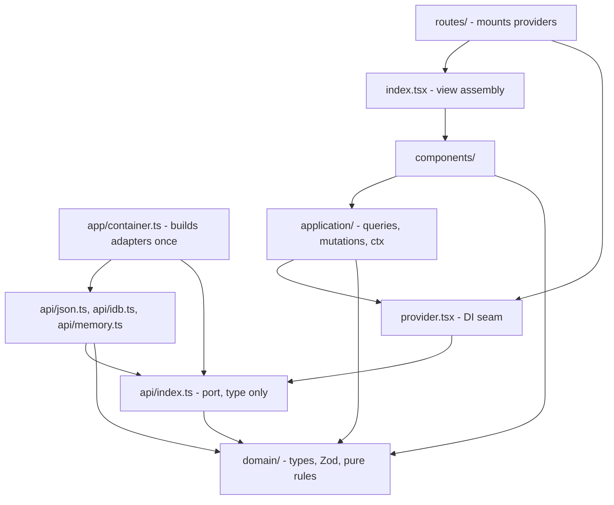
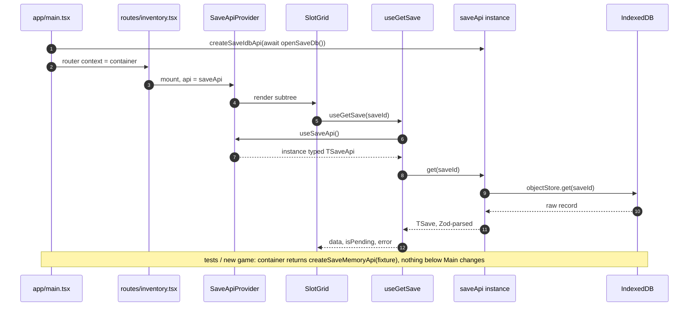
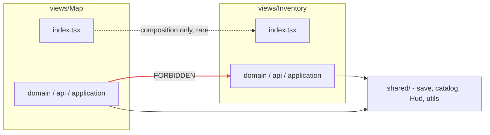

# Couple Battle — Frontend Architecture (LAW)

> This document is the **architecture contract** for the codebase. The generic document below
> (from Luca, verbatim, starting at "# Frontend architecture") defines the structure; this preamble
> pins the stack and maps the generic examples onto Couple Battle. When in doubt, this file wins
> over convenience. It is deliberately more architecture than an MVP needs — that is intentional:
> when a server is added later, only adapters and the container change.

## Pinned stack

| Piece | Choice | Notes |
|---|---|---|
| React | **React 19** — https://react.dev/blog/2024/12/05/react-19 | `useEffectEvent` is the only sanctioned "stabilize a callback" tool (conventions below) |
| Language | TypeScript, strict | `tsc --noEmit` must pass at every commit |
| Build | Vite | |
| Router | **@tanstack/react-router** — https://tanstack.com/router | **Use `createHashHistory()`** — GitHub Pages has no SPA rewrites. Router context carries the DI container exactly as the doc below shows. Pin the installed version and consult its docs for current APIs — do not write route code from memory |
| Async cache | **@tanstack/react-query v5** — https://tanstack.com/query | Fronts the local ports (JSON catalog, IndexedDB) — there is no HTTP |
| Validation | **Zod** | Parse at every adapter boundary |
| PWA | **vite-plugin-pwa** — https://vite-pwa-org.netlify.app/guide/ | `registerType: 'autoUpdate'`, precache everything: the game must be fully playable offline after first load |
| IndexedDB | **idb** (thin promise wrapper) | Used only inside `api/idb.ts` adapters |
| i18n | **No library — typed dictionaries + a ~30-line hook** (decision) | `src/data/strings.fr.ts` / `strings.en.ts` export `as const` objects; `shared/i18n` exposes `useT(): (key: TStringKey, vars?: Record<string, string \| number>) => string` with `TStringKey = keyof typeof fr` and `{name}`-style interpolation. Wrong keys are compile errors — with 2 locales and ~185 flat keys this beats react-i18next. FR is the fallback language |
| Testing | Vitest + React Testing Library | Memory adapters at the provider — never mock IndexedDB (doc below) |

## Mapping the generic doc onto Couple Battle

The doc below uses an RPG inventory as its running example. Translate as follows:

| Generic example | Couple Battle equivalent |
|---|---|
| `shared/catalog` (items.json) | `shared/questions` — bundled `questions.fr.json` / `questions.en.json`; port `TQuestionsApi { list(filter: TQuestionFilter): Promise<TQuestion[]> }`; adapter `json.ts` picks the file by language; `staleTime: Infinity` |
| `shared/save` (IndexedDB) | `shared/save` — one `TSaveApi` port over one IDB database covering: `settings`, `seenQuestionIds`, `guidelinesSeen`, `soloBest`, `gameSnapshot` (see handoff/docs/views-spec.md §2 for shapes) |
| `views/Inventory` etc. | `views/Home`, `views/Setup`, `views/Mode`, `views/Difficulty`, `views/Settings`, `views/HowToPlay`, `views/Legal`, `views/Play` |
| domain services (`canEquip`) | `drawDeck`, `reduce(machine, event)`, `applyScore`, `rankTeams`, … — the game reducer lives in `views/Play/domain/` and is **always tested** |
| `Hud` | `shared/Chrome` — `PixelButton`, `PixelPanel`, `Sprite`, `ProgressDots`, `PauseButton`, … styled from `handoff/design/tokens.css` |

**The one sanctioned deviation from "1 route = 1 view":** the flow inside a game (pass-phone →
secret answers → reveal → judge → countdown → resolve → …) is a **state machine in
`views/Play/domain/machine.ts`** (discriminated-union state + pure reducer), NOT nested routes —
a URL change must never be able to skip a secret screen or replay a judged question
(handoff/docs/views-spec.md §1 "Routing model"). The in-game screens live in `views/Play/components/`
(one folder per V-* id). Hardware/browser back inside `#/play` opens the pause sheet.
Everything else follows the doc below to the letter.

Two more game-specific ports built in `app/container.ts`: **sound** (`TSoundApi` port; adapter
wraps `handoff/lib/sounds.js` ported to TS; no-op adapter for tests) and **wake lock** (`TWakeLockApi`;
no-op adapter for tests and unsupported browsers).

---

# Frontend architecture — game (views + local storage)

Hexagonal / Clean Architecture for a **client-only game**. Stack: **React**, **TanStack Query** (async cache, not a server), **TanStack Router**, **Zod**.

Code is sliced **by view**, not by layer. Each view is a full vertical (`domain` → `api` → `application` → `components`). `shared/` holds views, entities, and utils used by 2+ screens.

There is **no HTTP**. The `api/` layer still exists: it is a **port**. Implementations talk to a **JSON catalog** (static game data) or **IndexedDB** (player save). Swap them at the DI boundary.

Running example: `views/Inventory/` + shared `catalog` (JSON) + shared `save` (IndexedDB).

---

## Mental model

A diagram lies when one arrow means two things. These are split: this one is **static — who may import whom**. The runtime call order is a separate diagram in the DI section below.



Every arrow means **imports**, nothing else. The payoff is what is missing: no path from `components/` or `application/` down to an adapter. The only module that names a concrete backend is `app/container.ts`.

- **Domain** — entities + rules (`canEquip`, `stackInto`). No React, no storage.
- **API (port)** — `api/index.ts` exports only the async contract type. **Not** `fetch`.
- **Adapters** — `json.ts`, `idb.ts`, `memory.ts`. Same port type, different backend. Zod parses at this boundary.
- **Provider** — holds an instance typed as the port. Knows no backend.
- **Application** — TanStack hooks + optional UI context. Reads the port via `use[View]Api()`. Never `create*`s it.
- **Components** — render. Application hooks + domain services only.
- **Composition** — `app/container.ts` builds adapters once; `routes/` mounts providers.

---

## Dependency injection (the point of the architecture)

UI must not know *where* a sword comes from. Tests must not open IndexedDB. A new-game flow can use memory; a continue flow uses IDB; catalog always comes from JSON.

### Port vs adapters

```ts
// api/index.ts — PORT (type only lives here for consumers)
export type TSaveApi = {
  get(id: string): Promise<TSave>;
  put(id: string, { set }: { set: TSave }): Promise<TSave>;
};
```

```ts
// api/idb.ts — ADAPTER
export function createSaveIdbApi(db: IDBDatabase): TSaveApi { /* … */ }

// api/json.ts — ADAPTER (static catalog, read-only)
export function createCatalogJsonApi(data: unknown): TCatalogApi { /* … */ }

// api/memory.ts — ADAPTER (tests, new game before first persist)
export function createSaveMemoryApi(seed?: TSave): TSaveApi { /* … */ }
```

### One composition root, built once

An IndexedDB handle is stateful and expensive — do not open one per route visit. Build every adapter **once** in `app/container.ts`, hand it to the router as context, and let routes only mount providers.

```ts
// app/container.ts — the only module that names a backend
export type TContainer = {
  catalogApi: TCatalogApi;
  saveApi: TSaveApi;
};

export async function createContainer(
  mode: 'persistent' | 'memory' = 'persistent',
): Promise<TContainer> {
  return {
    catalogApi: createCatalogJsonApi(),
    saveApi:
      mode === 'memory'
        ? createSaveMemoryApi()
        : createSaveIdbApi(await openSaveDb()),
  };
}
```

```tsx
// app/main.tsx
const container = await createContainer();
const router = createRouter({ routeTree, context: { ...container, queryClient } });
```

Three rules that make DI real:

1. **`provider.tsx` depends on the port type**, never on `idb.ts` / `json.ts`.
2. **`application/` only calls `useSaveApi()`.** It never imports `createSaveIdbApi`.
3. **`app/container.ts` is the only module that picks a backend.** `routes/` mounts providers with what context already holds.

### Runtime flow

Same story, now as call order — construction, injection, read.



Add a file-backed save or a WASM store later: one new factory, one line in the container. No view changes.

**Tests:** wrap with `SaveApiProvider api={createSaveMemoryApi(fixture)}` + `QueryClientProvider`. Never mock IndexedDB or `fetch`.

---

## Folder structure

`views/` and `shared/` are both divided **by view / entity**. Same internal layers. `shared/` also holds cross-cutting `utils/`.

```tree
src/
├── app/
│   ├── container.ts                      # builds every adapter once — only place naming a backend
│   └── main.tsx                          # createContainer() -> createRouter({ context })
│
├── views/
│   └── Inventory/                        # PascalCase screen
│       ├── domain/
│       │   ├── types.ts                  # T* + Z*Schema
│       │   ├── services.ts               # canEquip, stackItems
│       │   └── services.test.ts          # always
│       ├── api/
│       │   ├── index.ts                  # TInventoryApi port (+ optional factory types)
│       │   ├── json.ts                   # catalog-backed reads (if exclusive)
│       │   ├── idb.ts                    # persist (if exclusive)
│       │   └── memory.ts                 # tests
│       ├── application/
│       │   ├── ctx.tsx                   # optional UI ctx (selected slot)
│       │   ├── queries.ts
│       │   └── mutations.ts
│       ├── components/
│       │   ├── SlotGrid/
│       │   │   ├── index.tsx
│       │   │   └── useSlotGridState.ts
│       │   └── EquipButton.tsx
│       ├── views/                        # nested screens = nested routes
│       │   └── Inspect/                  # URL: inventory/$itemId
│       │       ├── application/
│       │       ├── components/
│       │       └── index.tsx
│       ├── provider.tsx                  # DI: Provider + useInventoryApi()
│       ├── index.tsx                     # view assembly + public re-exports
│       └── view.md                       # why, not how
│
├── shared/                               # 2+ views, or game-wide utils
│   ├── catalog/                          # static JSON bestiary / items
│   │   ├── domain/
│   │   ├── api/
│   │   │   ├── index.ts                  # TCatalogApi
│   │   │   └── json.ts                   # parse bundled items.json
│   │   ├── application/
│   │   ├── provider.tsx
│   │   └── index.ts
│   ├── save/                             # player persist
│   │   ├── domain/
│   │   ├── api/
│   │   │   ├── index.ts                  # TSaveApi
│   │   │   ├── idb.ts
│   │   │   └── memory.ts
│   │   ├── application/
│   │   └── provider.tsx
│   ├── Hud/                              # shared view chrome
│   └── utils/
│       └── react/
│
└── routes/
    ├── __root.tsx                        # createRootRouteWithContext<TContainer>()
    ├── map.tsx
    └── inventory.tsx                     # reads context, mounts providers
```

### Naming

| Thing | Case | Example |
|---|---|---|
| View / nested view / component folder | PascalCase | `views/Inventory/`, `views/Inspect/`, `components/SlotGrid/` |
| Layer folders | camelCase | `domain/`, `api/`, `application/`, `components/` |
| Fast-context files | lowercase | `application/ctx/selection.tsx` |
| Domain types | `T` prefix | `TItem`, `TSaveApi` |
| Zod schemas | `Z` + `Schema` | `ZItemSchema` |
| State updaters | `make*` if curried, bare verb if `(state) => next` | `makeSelectSlot`, `clearSelection` |
| Adapter factories | `create[Name][Backend]Api` | `createSaveIdbApi`, `createCatalogJsonApi` |

### Folder rules

- Folder only when 2+ related files. Single files stay flat.
- Component folder only when it has a UI hook or private sub-components. No nested `components/` — private pieces are flat files in the parent folder.
- Tests sit next to what they test. Never `__tests__/`.
- **1 route = 1 view. 1 subroute = 1 nested view.** Nested views render on their own route; they are not embedded in the parent screen.

---

## Layers, with examples

### `domain/types.ts` — entities, not props

```ts
import { z } from 'zod';

export const ItemKind = {
  Weapon: 'weapon',
  Armor: 'armor',
  Consumable: 'consumable',
} as const;
export type TItemKind = typeof ItemKind[keyof typeof ItemKind];

export const ZItemSchema = z.object({
  id: z.string(),
  name: z.string().min(1),
  kind: z.enum(['weapon', 'armor', 'consumable']),
  slot: z.enum(['head', 'body', 'hand', 'none']),
  stackMax: z.number().int().positive(),
});
export type TItem = z.infer<typeof ZItemSchema>;

export const ZInventorySchema = z.object({
  slots: z.array(z.object({
    itemId: z.string(),
    qty: z.number().int().positive(),
  })),
});
export type TInventory = z.infer<typeof ZInventorySchema>;
```

Prop types stay in the component file.

### `domain/services.ts` — pure game rules

No async, no storage, no React. Always tested.

```ts
import type { TInventory, TItem } from './types';

export function canEquip(item: TItem, occupied: Set<string>) {
  if (item.slot === 'none') return false;
  return !occupied.has(item.slot);
}

export function stackInto(inventory: TInventory, itemId: string, qty: number): TInventory {
  // …pure, returns a new inventory
}
```

Would this make sense without a screen (combat sim, CLI)? → domain. Exists only because of a widget? → `components/<Name>/useX.ts`.

### `api/` — port + local adapters (no server)

The **port** is the contract. **JSON** = bundled catalog. **IndexedDB** = player save. **Memory** = tests / unsaved session.

Zod parse happens in every adapter as data crosses the boundary.

```ts
// shared/catalog/api/index.ts
export type TCatalogApi = {
  getItem(id: string): Promise<TItem>;
  listItems(filter?: { kind: TItemKind }): Promise<TItem[]>;
};

// shared/catalog/api/json.ts
import itemsJson from '../data/items.json';

export function createCatalogJsonApi(raw: unknown = itemsJson): TCatalogApi {
  const items = z.array(ZItemSchema).parse(raw);
  const byId = new Map(items.map((item) => [item.id, item]));

  return {
    async getItem(id) {
      const item = byId.get(id);
      if (!item) throw new Error(`Item ${id} not found`);
      return item;
    },
    async listItems(filter) {
      if (!filter) return items;
      return items.filter((item) => item.kind === filter.kind);
    },
  };
}
```

```ts
// shared/save/api/idb.ts
export function createSaveIdbApi(db: IDBDatabase): TSaveApi {
  return {
    async get(id) {
      const raw = await idbGet(db, 'saves', id);
      return ZSaveSchema.parse(raw);
    },
    async put(id, { set }) {
      const parsed = ZSaveSchema.parse(set);
      await idbPut(db, 'saves', id, parsed);
      return parsed;
    },
  };
}

// shared/save/api/memory.ts
export function createSaveMemoryApi(seed?: TSave): TSaveApi {
  let current = seed ?? emptySave();
  return {
    async get() {
      return current;
    },
    async put(_id, { set }) {
      current = ZSaveSchema.parse(set);
      return current;
    },
  };
}
```

Method shape (same as before, storage instead of HTTP):

```ts
getById(id: string)
list(filter: TItemFilter, options?: { limit: number })
put(id: string, { set }: { set: TSave })
```

Group args by theme (identity / payload / options) when there are more than two. One identifier stays positional.

**Never** `import items.json` from `application/` or `components/`. The JSON file is an adapter input, wired in `app/container.ts`.

### `provider.tsx` — DI seam

Depends on **`TSaveApi`**, not on IndexedDB.

```tsx
import { createContext, useContext, type FC, type PropsWithChildren } from 'react';
import type { TSaveApi } from './api';

const SaveApiCtx = createContext<TSaveApi | null>(null);

export const SaveApiProvider: FC<PropsWithChildren<{ api: TSaveApi }>> = ({
  api,
  children,
}) => <SaveApiCtx.Provider value={api}>{children}</SaveApiCtx.Provider>;

export function useSaveApi(): TSaveApi {
  const ctx = useContext(SaveApiCtx);
  if (!ctx) throw new Error('SaveApiProvider not found in tree');
  return ctx;
}
```

A view that needs several ports can bundle them (`{ catalogApi, saveApi }`) in one provider — still types only, still built in the container.

```tsx
type TInventoryApis = {
  catalogApi: TCatalogApi;
  saveApi: TSaveApi;
};
```

### `application/queries.ts` — all TanStack Query

Async **storage** reads. Owns query keys. Reads ports via `use[View]Api()`.

```ts
export const saveKeys = {
  all: ['save'] as const,
  byId(id: string) {
    return ['save', id] as const;
  },
};

export function saveQueryOptions(api: TSaveApi, id: string) {
  return queryOptions({
    queryKey: saveKeys.byId(id),
    queryFn: () => api.get(id),
  });
}

export function useGetSave(id: string) {
  const api = useSaveApi();
  return useQuery(saveQueryOptions(api, id));
}
```

The options factory takes the port as an argument, so a route loader can prefetch with the instance it already has in context — without any hook and without importing an adapter.

Catalog is static JSON but still goes through Query so the rest of the app has one loading/error pattern:

```ts
export function useGetItem(id: string) {
  const api = useCatalogApi();
  return useQuery({
    queryKey: catalogKeys.item(id),
    queryFn: () => api.getItem(id),
    staleTime: Infinity, // bundled JSON does not change at runtime
  });
}
```

**Forbidden:** standalone `application/use*.ts`. UI glue → `components/<Name>/useX.ts`. Shared client UI state → `ctx`. Persistence → queries/mutations.

### `application/mutations.ts`

```ts
export function usePutSave(id: string) {
  const api = useSaveApi();
  const qc = useQueryClient();
  return useMutation({
    mutationFn: (set: TSave) => api.put(id, { set }),
    onSuccess: () => {
      qc.invalidateQueries({ queryKey: saveKeys.byId(id) });
    },
  });
}
```

### `application/ctx.tsx` vs `ctx/*.tsx`

| When | Where |
|---|---|
| Small shared UI state (selected slot, pause menu open) | `ctx.tsx` |
| Normalised store + selectors, hot updates (many HUD subscribers) | `ctx/*.tsx` + `domain/services/<slice>/` |
| One widget | local state / `useMyComponentState.ts` |
| Catalog / save data | TanStack Query — never context |

### `index.tsx` — view + public surface

1. Assemble the screen the route renders.
2. Re-export types, hooks, provider — the **only** composition surface.

```tsx
import { type FC } from 'react';
import { SlotGrid } from './components/SlotGrid';
import { EquipButton } from './components/EquipButton';

export const InventoryView: FC = () => (
  <div>
    <SlotGrid />
    <EquipButton />
  </div>
);

export type { TInventory } from './domain/types';
export { useGetSave } from './application/queries';
export { usePutSave } from './application/mutations';
export { useInventoryApi, InventoryApiProvider } from './provider';
```

Nested-view `index.tsx` only assembles a screen — no public re-exports.

### `view.md`

Non-obvious decisions only: why catalog is `shared/` not inside Inventory, why save mutations skip optimistic update, why Inspect is a nested view.

### Route = where providers get mounted

Adapters arrive through router context. The route names **which** ports this screen needs, never **which** backend.

```tsx
// routes/__root.tsx
export const Route = createRootRouteWithContext<
  TContainer & { queryClient: QueryClient }
>()({ component: RootLayout });
```

```tsx
// routes/inventory.tsx
import { createFileRoute } from '@tanstack/react-router';
import { CatalogApiProvider } from '@/shared/catalog/provider';
import { SaveApiProvider } from '@/shared/save/provider';
import { InventoryView } from '@/views/Inventory';

export const Route = createFileRoute('/inventory')({
  loader: ({ context }) =>
    context.queryClient.ensureQueryData(
      saveQueryOptions(context.saveApi, 'slot-1'),
    ),
  component: InventoryRoute,
});

const InventoryRoute: FC = () => {
  const { catalogApi, saveApi } = Route.useRouteContext();
  return (
    <CatalogApiProvider api={catalogApi}>
      <SaveApiProvider api={saveApi}>
        <InventoryView />
      </SaveApiProvider>
    </CatalogApiProvider>
  );
};
```

The loader is for **prefetching** into the query cache, not for constructing adapters — a loader re-runs on every navigation.

New game / tests / Storybook: `createContainer('memory')`. `InventoryView` does not change.

---

## Import boundaries

### View slice

Every `views/<Name>/` (and every `shared/<Name>/` entity) is a full vertical. Nested views under `views/<Parent>/views/<Child>/` follow the same rule when the code is exclusive to that subroute.

### Cross-view = `shared/` (hard rule)

`views/Map` must **not** import `views/Inventory/domain`, `views/Inventory/api`, or `views/Inventory/application` — including type-only imports.

Shared HUD, catalog, save, utils → `shared/`. Composition of another **screen** (rare) goes through that view's `index.tsx`.

| Layer | May import |
|---|---|
| `app/container.ts` | every `api/*.ts` **adapter factory** — the only module allowed to |
| `routes/` | view `index.tsx`, `provider.tsx`, `shared/*/index.tsx` — takes adapters from context, never constructs them |
| `components/` | `application/`, `domain/services`, `shared/*/index.tsx` |
| `application/` | `domain/types`, `domain/services`, `provider` (`use[View]Api()`), `shared/*/index.tsx` |
| `provider.tsx` | `api/` **type** only, optionally `application/ctx` |
| `domain/` | `shared/*/domain/` only — no React, no IDB, no JSON imports |
| `api/` adapters | `domain/types` only |
| nested view | anything in the **parent** (by path); never sibling views |



### Golden rules

1. Domain imports nothing outside `shared/*/domain/`.
2. `api/` implements domain types, never the reverse. Adapters (JSON / IDB / memory) are imported by **`app/container.ts` only**.
3. Application hooks never instantiate an adapter — they `use[View]Api()`.
4. `provider.tsx` is the DI seam (port type in, instance from above).
5. Components never import `api/` — only `application/` and `domain/services`.
6. Cross-view composition via `index.tsx`. Shared contracts via `shared/`.
7. **`app/container.ts` builds; `routes/` mounts.** Nothing else wires.
8. Nested views are full views. They may import parent internals. They never import siblings.
9. `index.tsx` assembles the screen **and** re-exports. Route injects providers. Those stay separate.
10. No sibling view internals. Escape hatch: `shared/<Entity>/` or `shared/utils/`.

---

## Nested views and locality

Keep code as close as possible to the view that needs it. Promote only when shared.

| Situation | Where it lives |
|---|---|
| Used only by this nested view | inside it |
| Used by a sibling or the parent | promote to the parent |
| Nested view reads parent-owned save/catalog | import the parent's query keys — don't redeclare |
| Nested view needs parent internals | import by path |
| Parent needs a nested view | only `views/*/index.tsx`, and only when embedding (rare) |

```tree
views/Map/
├── views/
│   ├── Encounter/      # route: /map/encounter
│   └── Travel/         # route: /map/travel
└── index.tsx
```

---

## Placement cheat sheet

| You have… | It goes in… |
|---|---|
| Entity type or Zod schema | `domain/types.ts` |
| Pure rule (`canEquip`) | `domain/services.ts` |
| Storage contract (port) | `api/index.ts` |
| Bundled `items.json` reader | `api/json.ts` |
| IndexedDB persist | `api/idb.ts` |
| In-memory / test / new-game | `api/memory.ts` |
| Simple shared UI state | `application/ctx.tsx` |
| Normalised UI store + selectors | `application/ctx/*.tsx` + `domain/services/<slice>/` |
| Async read hook | `application/queries.ts` |
| Async write + cache | `application/mutations.ts` |
| Local widget state | `components/MyComponent/useMyComponentState.ts` or inline |
| UI glue for one area | `components/<Name>/useX.ts` |
| Hook shared across component folders, not ctx-worthy | `utils/useX.ts` at view root |
| Standalone `application/use*.ts` | **forbidden** |
| React component | `components/` |
| Prop type | inside the component file |
| Entity / chrome / util used by 2+ views | `shared/[name]/` |
| Screen assembly | view-root `index.tsx` |
| Nested screen | `views/<Name>/` inside the parent |
| Non-obvious decision | `view.md` |

---

## Testing

| What | Test | Required? |
|---|---|---|
| domain services / slice `actions.ts` | co-located `*.test.ts` | **always** |
| selectors | `selectors.test.ts` | when non-trivial |
| queries / mutations | `*.test.ts` | when transforms, enabled flags, optimistic update |
| folder component | `[Name].test.tsx` | when branching / interactions |
| nested-view component | `[Name].test.tsx` | **always** |
| `api/` adapters, `ctx`, `provider` | — | covered via hook/component tests |

| Layer | Wrap with |
|---|---|
| domain | nothing |
| queries / mutations | `[View]ApiProvider` (**memory** adapter) + `QueryClientProvider` |
| component with queries | same |

Swap `createSaveMemoryApi` / `createCatalogJsonApi(fixture)` at the provider. Do not mock IndexedDB.

---

## TypeScript conventions

**Type imports last, with `type`:**

```ts
import { useState, type FC, type ReactNode } from 'react';
import { type TSaveApi } from './api';
```

**`type` over `interface`.** Interface only for declaration merging (comment why).

**No enums** — `as const` objects or string unions.

**Group function args by theme.** React props stay one object. One-id helpers stay positional.

**JSDoc** on functions that are not obvious one-liners.

---

## React conventions

Components: `const Name: FC<Props> = (props) => …`. Generics drop `FC`, stay arrows.

Explicit variants over boolean soup. Compound components + `children` for structure.

### No `useCallback`

Do not wrap handlers in `useCallback`. Let the function be recreated. If an **effect** must call the latest handler without re-subscribing, use **`useEffectEvent`** — that is the only "stabilize this callback" tool. Do not introduce `useCallback` to feed an effect dependency array.

```tsx
// forbidden
const handleEquip = useCallback(() => { /* … */ }, [itemId]);

// default — named handler, new each render is fine
const handleEquip = () => {
  putSave.mutate(equip(save, itemId));
};

// last resort — effect needs latest handler, subscription stays stable
const onKey = useEffectEvent((e: KeyboardEvent) => {
  if (e.key === 'e') putSave.mutate(equip(save, itemId));
});
useEffect(() => {
  window.addEventListener('keydown', onKey);
  return () => window.removeEventListener('keydown', onKey);
}, []);
```

### `useEffect` — avoid, then use when it is actually an external system

Prefer: derive during render, event handlers, Query, `key` to reset.

| Instead of effect for… | Use |
|---|---|
| Loading catalog / save | TanStack Query |
| Computed values | derive / domain service |
| Click / submit / drag | named event handler / mutation |
| Reset on prop change | `key` prop |

**Legitimate effects** (external systems): `requestAnimationFrame` game loop, keyboard/pointer capture, IndexedDB `versionchange`, Howler/WebAudio, canvas resize observer.

```tsx
// wrong — derived state
useEffect(() => { setLabel(`${item.name} ×${qty}`); }, [item, qty]);

// right
const label = `${item.name} ×${qty}`;
```

```tsx
// right — game loop is an external clock
useEffect(() => {
  let frame = 0;
  const tick = (t: number) => {
    loopRef.current?.(t);
    frame = requestAnimationFrame(tick);
  };
  frame = requestAnimationFrame(tick);
  return () => cancelAnimationFrame(frame);
}, []);
```

### No anonymous functions for **event handlers** in JSX

Extract a child that closes over the id, or a `makeEquipHandler(id)` factory.

**Render props may be anonymous.** Returning JSX is composition, not an action.

```tsx
// forbidden — action callback
<button onClick={() => equip(item.id)}>Equip</button>

{items.map((item) => (
  <button key={item.id} onClick={() => equip(item.id)}>
    {item.name}
  </button>
))}

// right — extract
const SlotRow: FC<{ itemId: string; name: string; onEquip: (id: string) => void }> = ({
  itemId,
  name,
  onEquip,
}) => {
  const handleEquip = () => onEquip(itemId);
  return <button onClick={handleEquip}>{name}</button>;
};

// right — render prop (anonymous fn that returns JSX)
<SlotGrid
  slots={slots}
  renderSlot={({ slot }) => <ItemIcon itemId={slot.itemId} />}
/>
```

Rule of thumb: **returns JSX → inline arrow is fine. Performs an action → named handler / extracted child.**

Functional `setState` when next depends on previous. Lazy `useState(() => …)` for expensive init. Don't `useMemo` simple primitives. Don't `useCallback` to "help" memo.

---

## Worked mini-flow: "equip an item"

1. **`app/container.ts`** builds `createCatalogJsonApi()` + `createSaveIdbApi(await openSaveDb())` once; `main.tsx` puts them in router context.
2. **Route** reads context and mounts `CatalogApiProvider` + `SaveApiProvider` around `InventoryView`.
3. **View** renders `SlotGrid`.
4. **Grid** calls `useGetSave(id)` + `useGetItem(itemId)`.
5. **Queries** resolve the ports via `useSaveApi()` / `useCatalogApi()` and call them — IDB and JSON, Zod inside the adapters.
6. Domain `canEquip(item, occupiedSlots)` decides whether the button is enabled.
7. Named `handleEquip` (not anonymous, not `useCallback`) calls `usePutSave().mutate(…)` → IDB write → invalidate `saveKeys`.

Nobody outside `app/container.ts` imported `createSaveIdbApi` or `items.json`. Swap the container to memory for tests. Same view.
