# Couple Battle — Views & Flow Spec (v1.0)

> **The master per-screen spec.** One section per view: wireframe, purpose, layout, strings, assets, interactions, state, edge cases.
> v0.2 resolved the open questions (decision log §8) · v0.3 added wireframes · **v1.0 consolidates every decision from the whole design phase into detailed view specs.**
>
> Companion files in this folder:
> - `couple-battle-copy-assets.md` — full FR/EN string tables (keys referenced here) + asset manifest
> - `couple_battle_question_bank_v2.xlsx` — 1,035 bilingual questions (ID / Theme / Difficulty / Type / EN / FR / Source)
> - `pack/` — pixel sprites (SVG source of truth, PNG previews, PWA icons) · `wireframes/` — the screenshots below · `wireframes.html` — all frames in one page
> - `sounds.js` — complete Web Audio engine (all `sfx.*`/`mus.*` ids used below)
>
> Conventions: one shared phone, portrait, FR primary (EN secondary). "Team" = one couple (lovers or two close friends) with its pixel avatar. View ids (`V-…`) become component names.

---

## 1. Global flow

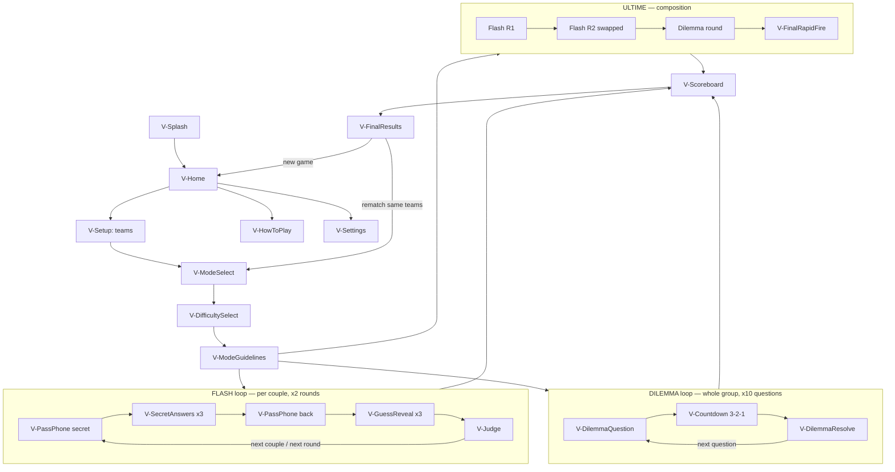

### Routing model

- Real routes (hash routing for GitHub Pages): `#/`, `#/setup`, `#/mode`, `#/difficulty`, `#/settings`, `#/how-to-play`, `#/legal`, `#/play`.
- **Everything inside a game (`#/play`) is a state machine, not routes** — pass-phone, secret input, reveal, judge, countdown, etc. are machine states. This prevents browser-back from skipping a secret screen or replaying a judged question. Hardware/browser back inside `#/play` opens `V-PauseSheet` instead of navigating.
- `V-Scoreboard` appears between rounds; `V-FinalResults` closes the game; a persistent ⏸ (top-right, ≥40×40 hit area) opens `V-PauseSheet` from any in-game state.

### Deck sizes (confirmed)

| Mode | Draw | Duration target |
|---|---|---|
| Flash | 3 questions × partner × 2 rounds (per couple) | ~10 min |
| Dilemma | 10 shared `who_of_two` questions | ~15 min |
| Ultime | Flash structure with 2 q/partner × 2 rounds + 5 dilemma + 5 rapid-fire per couple | 30+ min |

### Scoring (confirmed)

| Event | Points |
|---|---|
| Flash guess judged EXACT (or auto-match on `this_or_that`/`yes_no`) | +2 |
| Flash guess judged PRESQUE | +1 |
| Flash RATÉ / auto-mismatch | 0 |
| Dilemma couple match | +1 |
| Rapid-fire 💖 SYNCHRO | +2 |
| Rapid-fire 💀 MISMATCH | 0 |

Ties: shared crown — both duos win, copy celebrates both (`score.tied`). No tie-breaker at MVP.

---

## 2. State & data

**Persisted (IndexedDB, the only storage — no accounts, no server):**

| Key | Content |
|---|---|
| `settings` | `{lang: 'fr'\|'en', sound: bool}` |
| `seenQuestionIds` | number[] — global across games (ids are language-independent); reset via Settings |
| `guidelinesSeen` | `{flash: bool, dilemma: bool, ultime: bool}` |
| `soloBest` | `{flash: n, dilemma: n, ultime: n}` — solo-mode records |
| `gameSnapshot` | full session state, written on every state transition, cleared on game end — powers crash/refresh resume |

**Session state (in-memory, mirrored to `gameSnapshot`):**

```ts
{
  roster: [{teamId, avatarId, players: [name1, name2]}],   // 1–4 couples
  mode: 'flash'|'dilemma'|'ultime',
  difficulty: 'mix'|'easy'|'medium'|'hard',
  themes: string[],                    // active theme ids
  deck: Question[],                    // drawn at game start, in order
  cursor: {phase, round, coupleIdx, questionIdx},
  scores: Record<teamId, number>,
  secretAnswers: Record<qId, string>,  // current couple only, cleared after judging
}
```

**Question drawing (at game start, from bundled `questions.{lang}.json`):**
filter by mode compatibility (Flash → `open`+`this_or_that`+`yes_no` · Dilemma → `who_of_two` · Rapid-fire → `open` easy/medium only) → filter by difficulty (`mix` = all) → filter by active themes → exclude `seenQuestionIds` → shuffle → draw deck size. Drawn ids are added to `seenQuestionIds` when the game **completes** (not on draw, so an abandoned game doesn't burn questions). If the filtered pool is smaller than the deck, show `error.deckEmpty` and offer to reshuffle seen ids for those filters.

**PWA requirements:** vite-plugin-pwa (or equivalent) · installable manifest (icons in `pack/pwa-icons/`, name "Couple Battle", `display: standalone`, portrait) · precache everything — the game must be 100 % playable offline after first load · `navigator.wakeLock` requested while in `#/play` (re-request on `visibilitychange`) · `sound.unlock()` on first user gesture (see `sounds.js`).

---

## 3. Shell & pre-game views

### V-Splash

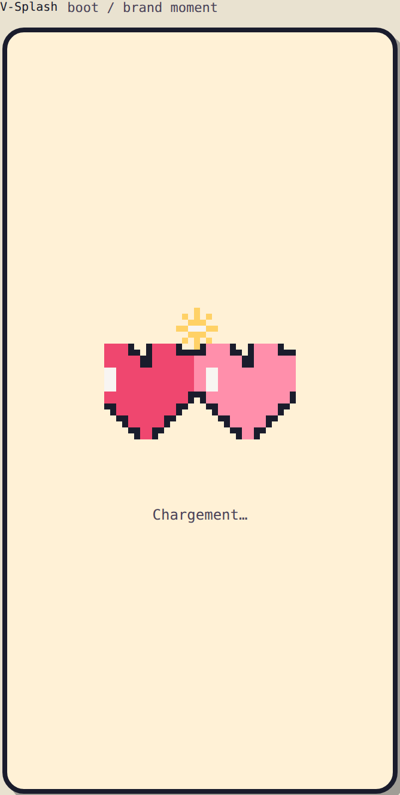

- **Purpose:** instant brand moment while the app boots; doubles as the PWA loading screen.
- **Layout:** `spr.logo.icon` centered, large (≈160px); `splash.loading` caption below.
- **Behavior:** plays `anim.logo.clash` (hearts slide in, clash, spark pops) + `sfx.splash.clash` *only if audio is already unlocked* (returning session) — first-ever visit stays silent (browser autoplay rules). Auto-advances to V-Home after ~1s or when the app is ready, whichever is later. No interaction.
- **Edge case:** if `gameSnapshot` exists → skip V-Home and show the resume prompt (see V-Home).

### V-Home

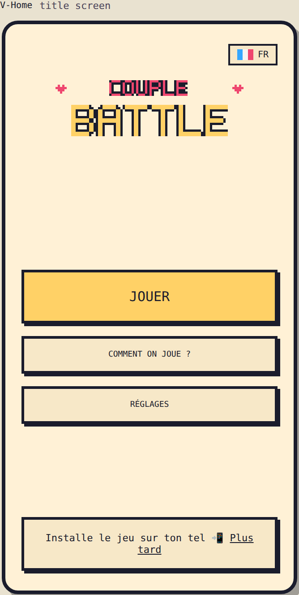

- **Purpose:** title screen. Get into a game in one tap.
- **Layout:** FR flag chip top-right (tap = quick language switch, same as Settings) · `spr.logo` centered with `anim.logo.bounce` idle · `home.play` as the one big gold button · `home.howto` and `home.settings` as ghost buttons · install hint panel pinned at bottom.
- **Install hint:** Android/desktop → capture `beforeinstallprompt`, show `home.install.android`, trigger native prompt on tap. iOS → `home.install.ios` tooltip once per browser (flag in IndexedDB). `home.install.dismiss` hides it for the session.
- **Charm (P2):** random pair of team avatars peeking from bottom corners (`anim.peek`); `mus.menu` starts here if sound on.
- **Resume:** if `gameSnapshot` exists, show a panel above JOUER: `common.resume.title/body` + `common.resume.yes` (restores machine state exactly) / `common.resume.no` (clears snapshot).
- **Strings:** `home.*`, `common.resume.*` · **Assets:** `spr.logo`, `spr.bg.hearts`, avatars · **SFX:** `sfx.tap`, `mus.menu`.

### V-HowToPlay

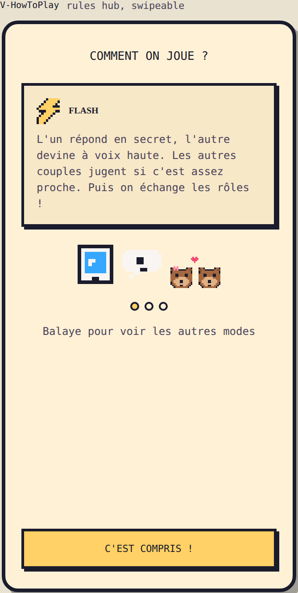

- **Purpose:** rules hub, reachable from Home anytime (rules also exist per-mode as V-ModeGuidelines — both, so nobody is forced through rules twice).
- **Layout:** title + 3 swipeable cards (`howto.flash/dilemma/ultime .title/.body`), each with a small demo scene built from `spr.demo.phone`, `spr.demo.bubble.*` and avatars (`anim.demo.*`) · progress dots · `howto.swipe` hint.
- **Interactions:** horizontal swipe or dot tap; close via back arrow → V-Home.
- **Strings:** `howto.*` · **SFX:** `sfx.tap`, muted `sfx.countdown.tick` inside the dilemma demo loop.

### V-Settings (+ V-Legal)

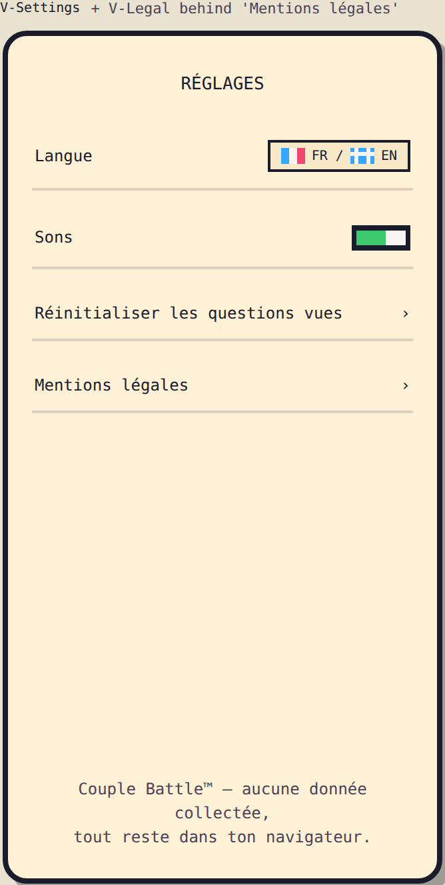

- **Layout:** simple rows — language (FR/EN chips, applies instantly app-wide), sound (`spr.ui.toggle` + `sfx.toggle.on/off`, drives `sound.setEnabled`), reset seen questions (confirm dialog `settings.resetSeen.confirm`, then `settings.resetSeen.done` toast), legal link.
- **V-Legal:** static page, `legal.title` + `legal.body` (trademark line + no-data statement + contact email). Nothing else.
- **Strings:** `settings.*`, `legal.*`.

### V-Setup (teams)

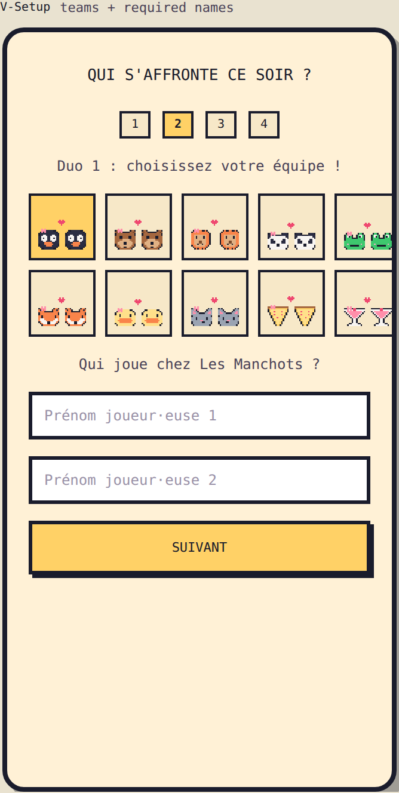

- **Purpose:** declare who's playing. Target: a 2-couple setup done in <45 s.
- **Flow:** ① couples count 1–4 (segmented chips; picking 1 shows `setup.couples.solo.hint`) → ② per couple, sequentially: avatar from the 10-cell grid (taken avatars grayscale + `spr.ui.lock`, tap → `sfx.error` + `setup.team.taken` toast; selection → `anim.avatar.selected` + `sfx.select`) → ③ the two first names, **required** (`setup.names.required` inline error on empty; autofocus first field; Enter jumps field → next).
- **Teams (10):** penguins, otters, lions, pandas, frogs, foxes, ducks, cats, pizzas, cocktails (`team.*` strings, `spr.avatar.*` sprites).
- **State:** builds `roster`. Back → V-Home (roster discarded).
- **Strings:** `setup.*`, `team.*` · **SFX:** `sfx.select`, `sfx.error`, `sfx.tap`.

### V-ModeSelect

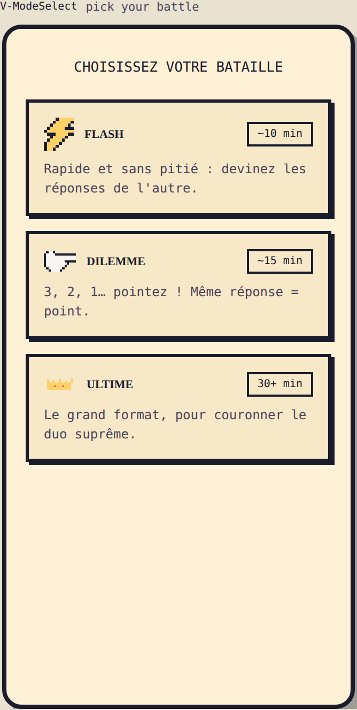

- **Layout:** 3 stacked cards (`spr.ui.panel`): badge (`spr.mode.flash` / `spr.mode.dilemma` / `spr.ui.crown`) + name + duration chip + 1-line description (`mode.*`).
- **Rules:** all modes available at any couple count (solo adaptations in §6). Rematch from V-FinalResults re-enters here with the same roster.
- **SFX:** `sfx.select`.

### V-DifficultySelect

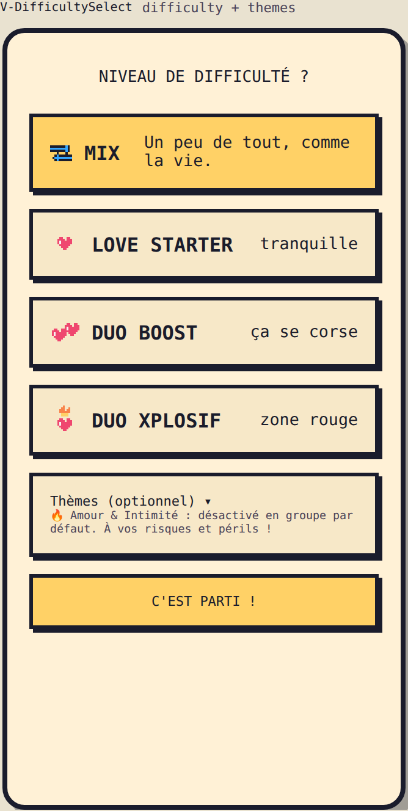

- **Layout:** 4 cards — **Mix (default, pre-selected)**, Love Starter, Duo Boost, Duo Xplosif (`diff.*`, `spr.diff.*`) · collapsed `themes.title` accordion below: 12 theme toggles (`theme.*`, `spr.theme.*`).
- **Theme rules:** all ON by default **except Love & Intimacy, OFF when roster >1 couple** (warning line `themes.intimacy.groupWarn` when toggled on); ON by default in solo.
- **CTA:** `common.start` → draws the deck (see §2) → V-ModeGuidelines.
- **Edge case:** filtered pool too small → `error.deckEmpty` dialog with reshuffle offer, stay on this view.
- **SFX:** `sfx.toggle.on/off` for themes, `sfx.select`.

### V-ModeGuidelines

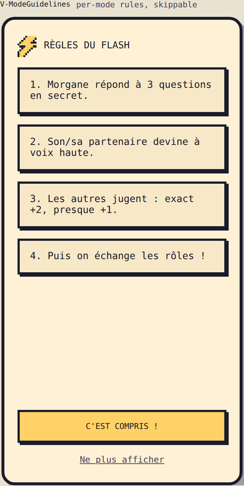

- **Layout:** mode badge + title, 3–4 numbered step panels (`guide.<mode>.s1–s4` — Flash steps interpolate the first answerer's real `{name}`), CTA `guide.gotit`, link `guide.dontshow`.
- **Behavior:** `guide.dontshow` sets `guidelinesSeen[mode]`; when set, this view is skipped automatically on later games (still reachable via V-HowToPlay).
- Entering this view = entering `#/play`: wake lock acquired, snapshot writing starts.

---

## 4. FLASH mode views

Loop per couple, ×2 rounds (roles swap in round 2). Order: couple 1 full sequence, then couple 2, etc. — not interleaved.

### V-PassPhone

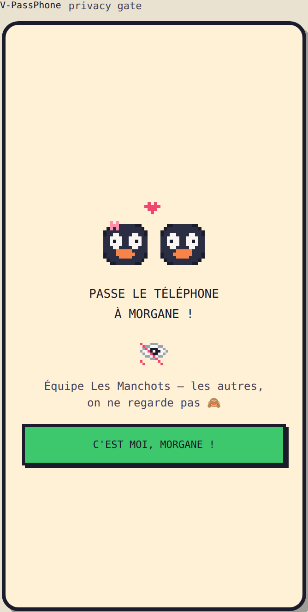

- **Purpose:** privacy gate before/after any secret input. Two variants:
  - *secret* (before V-SecretAnswers): `pass.secret.title` "Passe le téléphone à {name} !" + `pass.secret.sub` + `spr.ui.eye.no` + confirm `pass.secret.confirm` "C'est moi, {name} !"
  - *back* (after secrets locked): `pass.back.title` "Reposez le téléphone au centre !" + `pass.back.confirm`.
- **Layout:** big team avatar (≈110px), `anim.pass.slide`, `sfx.pass` on entry.
- **Design intent:** the confirm button is a deliberate friction — the named person must tap it, which socially enforces the hand-off.

### V-SecretAnswers

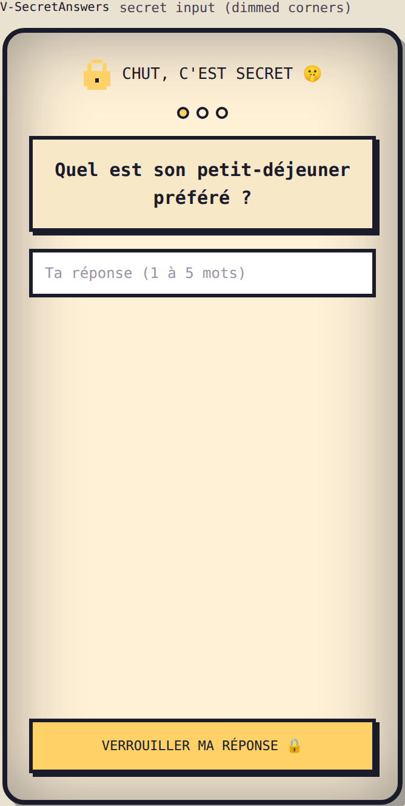

- **Purpose:** the answerer privately answers 3 questions (2 in Ultime).
- **Layout:** dimmed-corner vignette (secret signal) + `spr.ui.lock` + `secret.title` · progress dots · question panel · input.
- **Input by question type:** `open` → free text (`secret.placeholder`, maxlength 40, autocapitalize off) · `this_or_that` → two big option buttons · `yes_no` → OUI/NON buttons. Submit via `secret.submit` ("Verrouiller 🔒") → `anim.lock.close` + `sfx.lock`.
- **Rules:** no back once a question is locked (anti-cheat); after the 3rd, brief `secret.allDone` splash → V-PassPhone (back variant).
- **State:** answers into `secretAnswers`, snapshot after each lock (a crash never loses a locked answer).

### V-GuessReveal

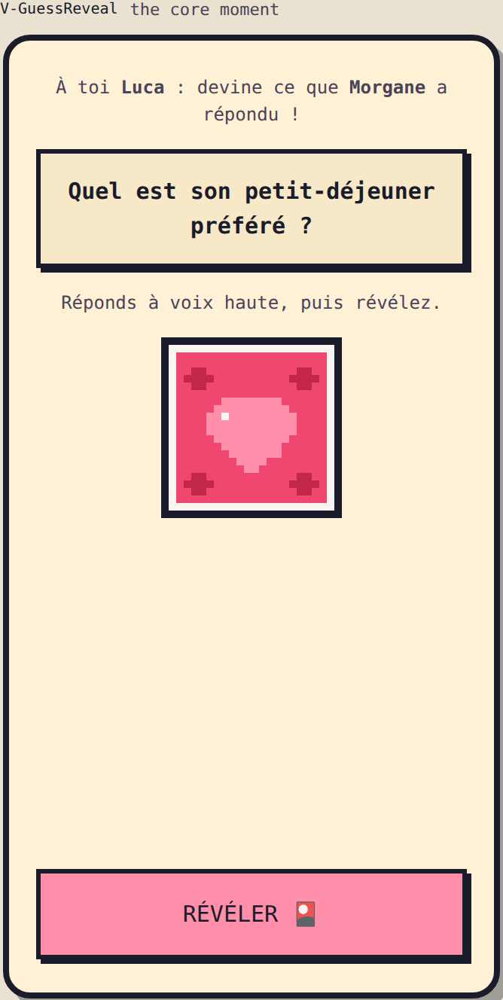

- **Purpose:** THE core moment. Phone back on the table, everyone watches.
- **Sequence per question:** ① header `guess.turn` ("À toi {name} : devine ce que {partner} a répondu !") + question huge + `guess.outloud` hint + `spr.card.back` face down → ② guesser answers **out loud**, anyone taps `guess.reveal` → ③ `anim.card.flip` + `sfx.reveal`, card shows `guess.answerWas` + the written answer → V-Judge.
- **Auto-judged types:** for `this_or_that`/`yes_no` the guesser taps their guess on screen *before* reveal; match/mismatch resolves automatically (`judge.auto.match/miss` splash + `sfx.point.exact`/`sfx.point.miss`), skipping V-Judge.

### V-Judge

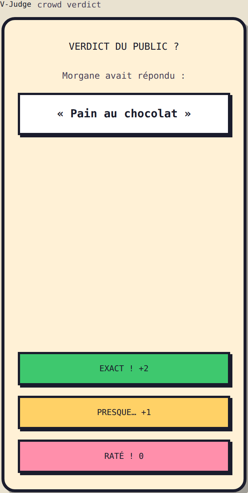

- **Purpose:** the room scores the guess — **one tap for the whole table**, verbal consensus, disputes resolved by shouting, as nature intended.
- **Layout:** `judge.title` · the revealed answer quoted on a white panel · 3 buttons: `judge.exact` (+2, green), `judge.close` (+1, gold), `judge.miss` (0, pink).
- **Feedback:** `anim.points.pop` ("+2" jumps out with `spr.ui.spark` / heart / `spr.ui.skull`) + `sfx.point.exact/close/miss`. Then next question, or next segment per loop control.
- **Loop control:** 3 questions guessed → next couple's V-PassPhone; all couples done → round 2 with roles swapped; round 2 done → V-Scoreboard → V-FinalResults (Flash has a single scoreboard stop at the end of round 1).

---

## 5. DILEMMA mode views

Whole group plays each of the 10 questions simultaneously.

### V-DilemmaQuestion

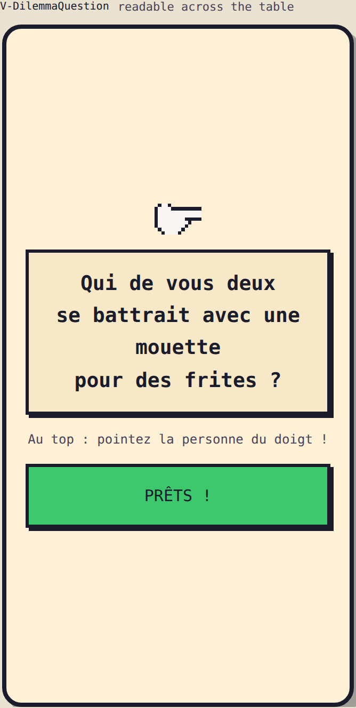

- **Layout:** `spr.mode.dilemma` badge · the `who_of_two` question HUGE (must be readable by 8 people around a table — min ~19px, high contrast) on `spr.ui.panel` with `anim.question.drop` · rule reminder `dilemma.rule` · CTA `dilemma.ready` ("PRÊTS !").
- **Progress:** `common.question` "Question {n}/10" small at top.

### V-Countdown

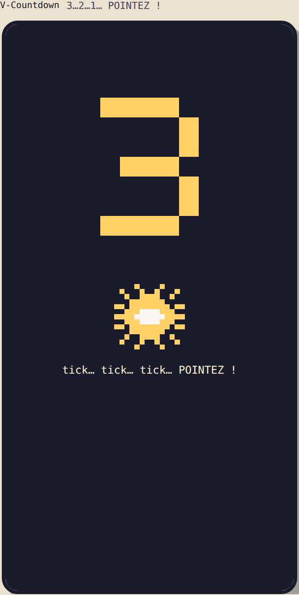

- **Purpose:** the 3-2-1 moment — the game's signature beat.
- **Layout:** **full ink-dark screen** (decision #9): giant `spr.count.3/2/1` digits slam in (`anim.count.pulse`), then `spr.count.burst` + "POINTEZ !" (`count.go`).
- **Sound/haptics:** `sfx.countdown.tick` per digit (rising pitch, `{step: 3|2|1}`), `sfx.countdown.go` on the burst, `navigator.vibrate(50)` per tick where supported. ~700 ms per step.
- **Behavior:** everyone **physically points** at a person (decision #7 — the app records nothing here). Auto-advances to V-DilemmaResolve ~1.5 s after GO.

### V-DilemmaResolve

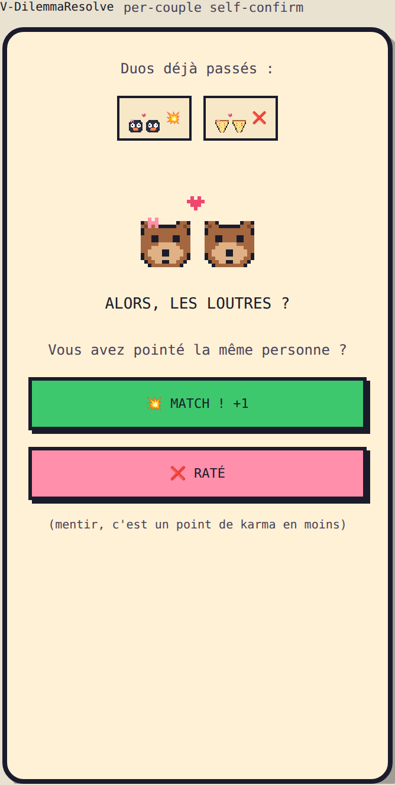

- **Purpose:** record match/no-match, **per-couple self-confirm** (decision #2).
- **Layout:** top strip `resolve.confirmed` with already-confirmed couples as avatar chips + 💥/❌ badge · active couple centered: avatar large, `resolve.title` "Alors, {team} ?", `resolve.question`, two buttons `resolve.match` (+1) / `resolve.miss` · karma joke `resolve.liarStrip` in small print.
- **Interaction:** the active couple taps their own result → `anim.resolve.advance` (card shrinks into the strip) → next couple. All confirmed → next question (V-DilemmaQuestion) or V-Scoreboard after 5 questions + V-FinalResults after 10.
- **SFX:** `sfx.point.exact` on match, `sfx.point.miss` on miss.

---

## 6. ULTIME mode + solo

Rounds 1–2 = Flash views (2 questions per partner) · round 3 = Dilemma views (5 questions) · round 4 = below. `V-Scoreboard` between each round.

### V-FinalRapidFire

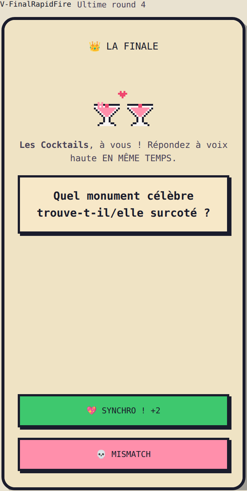

- **Purpose:** crown the champions. **Every couple plays** the finale (not only the leaders) — points decide the crown.
- **Intro:** `final.intro.title` "👑 LA FINALE" + `final.intro.body` full-screen once.
- **Per couple (in current-ranking order, last first):** `final.turn` "{team}, à vous !" → 5 questions, each: question huge → short countdown (2 ticks) → both partners answer **out loud simultaneously** → the room judges: `final.synchro` 💖 (+2) / `final.mismatch` 💀 (0) — same one-tap-for-the-table rule as V-Judge.
- **Atmosphere:** background darkens, pixel spotlight on the active team (`anim.final.bg`), `mus.final` loop runs (only place it plays).
- **SFX:** `sfx.synchro` / `sfx.mismatch`.

### Solo adaptation (roster = 1 couple)

- Flash: same flow, V-Judge becomes self-judging (same buttons, honor system).
- Dilemma: works unchanged (match/no-match).
- Ultime: rapid-fire self-judged.
- Copy switches to record-hunting: V-FinalResults shows `results.solo.newBest` / `results.solo.notBest` against `soloBest[mode]`; "battez votre record", never "battez les autres".

---

## 7. Between & after

### V-Scoreboard

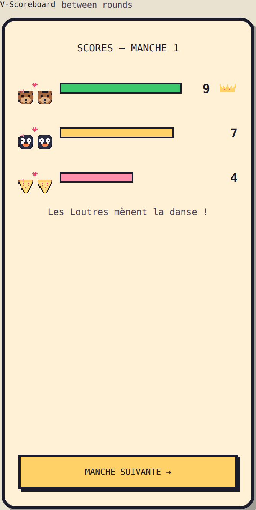

- **Layout:** `score.title` "Scores — Manche {n}" · one row per team: avatar + animated score bar (`anim.score.fill`, bars race with `sfx.score.tally` ticking) + total · leader gets tilted `spr.ui.crown` + `score.leader` line (`score.tied` when tied) · CTA `score.next`.
- Appears between rounds only — never inside a round.

### V-FinalResults

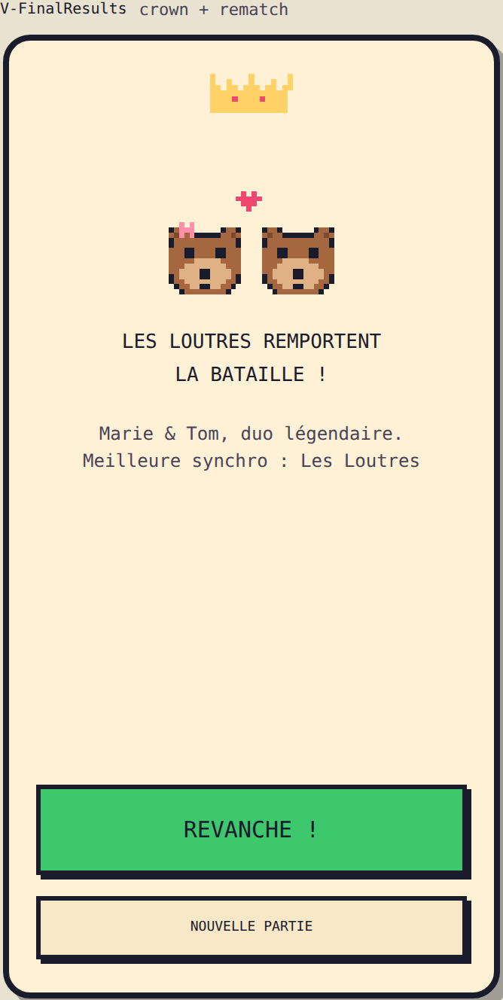

- **Sequence:** `anim.crown.drop` (crown falls on winning avatars, bounce, confetti `spr.ui.confetti` + `sfx.confetti`) + `mus.fanfare` (2 s, then silence — let the humans cheer) · `results.winner` "{team} remporte la bataille !" + `results.winner.sub` with both first names · full ranking below (losing avatars play `anim.avatar.cry`) · fun stat `results.stat.synchro` if cheap to compute.
- **CTAs:** `results.rematch` (same roster → V-ModeSelect) · `results.newgame` (→ V-Home). No share button (decision #4).
- **State:** deck ids appended to `seenQuestionIds`, `gameSnapshot` cleared, solo best updated.

### V-PauseSheet

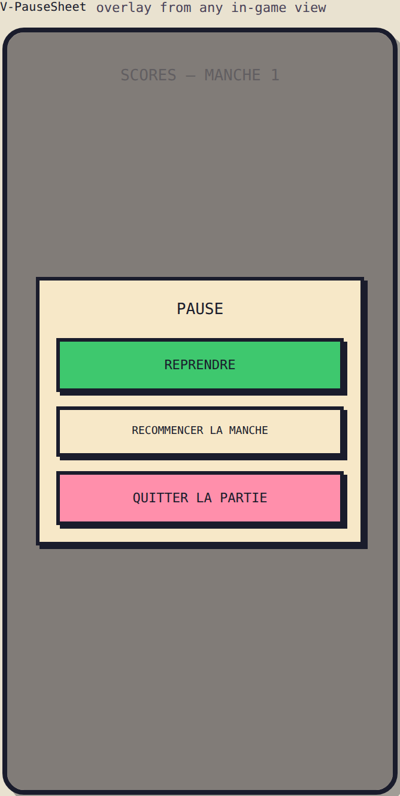

- **Overlay** (game visible dimmed behind): `pause.title` · `pause.resume` · `pause.restartRound` · `pause.quit` (confirm `pause.quit.confirm` — quitting clears the snapshot and returns to V-Home, scores lost).
- Music ducks to 30 % while open (`sound.duck(true)`). Opened by the ⏸ button or hardware back.


## 8. Decision log

1. **Love & Intimacy:** OFF by default in group games, toggleable on (ON by default in solo).
2. **Dilemma resolve:** per-couple self-confirm step (each couple taps its own MATCH/RATÉ).
3. **Deck sizes:** confirmed — table in §1.
4. **Share-result image:** not at MVP.
5. **Player names:** required at setup.
6. **Judging (Flash):** one tap for the whole table, verbal consensus — no per-team ballots.
7. **Dilemma pointing:** physical (the app never records who pointed at whom, only match/no-match).
8. **Difficulty:** Mix added as 4th option and default.
9. **Countdown screen:** full ink-dark background for drama (v0.3 wireframe call).
10. **Teams:** 10 (8 animals + pizzas + cocktails), duo avatars, left one wears the bow.
11. **Sound:** 100 % Web Audio synthesis, `sounds.js` is the reference implementation.
12. **Stack:** React SPA, frontend-only, PWA, GitHub Pages, hash routing. No analytics at MVP.
